```{r setup, include = FALSE}
knitr::opts_chunk$set(
  collapse = TRUE,
  comment = "#>"
)
```

> This vignette only embeds a rendered version of another `R` notebook, that evaluates the effect of hyperparameters of all functions used for inferencing in the package __`mmb`__. It should be displayed right below this paragraph. If you have trouble viewing it, check out the latest version on Github:  [Hyperparameter Evaluation](https://mrshoenel.github.io/R-mmb/articles/hyperparameters.html). Additional formats are available here: [Additional Formats](https://github.com/MrShoenel/R-mmb/tree/master/eval/).


---


Functions implemented in **`mmb`** support some hyperparameters. This
notebook evaluates them and compares performance to other well-known
methods, using some well-known methods. The results of this notebook are
included in the vignette *Hyperparameter Evaluation*. Since this is a
rather substantial analysis, it cannot be a vignette itself, and is
built externally.

Grid search
===========

In the first section, we are evaluating our new classifier and regressor
for some well known datasets, using a grid-search approach and `caret`.
We start with classification, then continue with regression. Those best
parameters will then be used in further comparisons against other
models.

In the following block, we can globally disable attempts to compute
results. If the resulting files are present, then the related
evaluations are skipped anyway. However, setting the following to FALSE,
will prevent the actual attempt.

    DISABLE_COMPUTATIONS <- TRUE
    # Used with many qualititave values as brewer color palette:
    QPALETTE <- "Set3"
    # This is in inches!
    tikzWidthFull <- 6.1 # 6.12619 original/maximal for JSS article

Let’s first install all the needed packages:

First, define the models we want to test:

    # Used by both regression and classification!
    caret_models <- c(
      "null", "bayesCaret", "ranger", "gbm", "mlpML", "bayesglm")

    # This is extra models used for classification/regression resp.:
    caret_models_c <- c(caret_models,
      "pam", "naive_bayes", "C5.0", "rda")
    caret_models_r <- c(caret_models,
      "knn", "pcr", "kernelpls", "rpart2")

We define a couple of helper-functions:

    # We will truncate all datasets to this amount if larger using
    # appropriate resampling!
    max_rows_dataset <- 2000


    #' Unifies the way we retrieve a dataset. Already splits the dataset
    #' into training- and validation partitions. The split is 0.7, if the
    #' amount of rows is less than 800; 0.85, otherwise.
    #' @param name a short-cut name of the dataset to obtain, e.g. "iris"
    #' @param seedMult an integer used for \code{set.seed()}. The seedMult
    #' influences how we sample into training and validation.
    #' @param useDs an optional data.frame of a 3rd party dataset. Use this
    #' to use your own dataset but still obtain a list as produced by this
    #' function.
    #' @param useLabel character the name of the label to use when passing
    #' in an own dataset using 'useDs'.
    #' @return list with the entries 'ds' (the entire dataset as data.frame),
    #' 'label' (name of column to be the label/target), 'train' and 'valid'
    #' (data.frames with training and validation data; train+valid = ds)
    get_dataset <- function(name, seedMult, useDs = NULL, useLabel = NULL) {
      set.seed((0xceed * seedMult * max_rows_dataset) %% .Machine$integer.max)
      
      ds <- NULL
      dsLabel <- "Class"

      if (name == "chick") {
        data("ChickWeight")
        ds <- data.frame(ChickWeight)
        dsLabel <- "Diet"
      } else if (name == "iris") {
        data("iris")
        ds <- iris
        dsLabel <- "Species"
      } else if (name == "credit") {
        data("GermanCredit")
        ds <- data.frame(GermanCredit)[, 1:10]
      } else if (name == "glass") {
        data("Glass")
        ds <- data.frame(Glass)
        dsLabel <- "Type"
      } else if (name == "breast") {
        data("BreastCancer")
        ds <- data.frame(BreastCancer)
        
        ds$Id <- NULL
        ds$Cl.thickness <- as.integer(ds$Cl.thickness)
        ds$Cell.size <- as.integer(ds$Cell.size)
        ds$Cell.shape <- as.integer(ds$Cell.shape)
        ds$Marg.adhesion <- as.integer(ds$Marg.adhesion)
        ds$Epith.c.size <- as.integer(ds$Epith.c.size)
        ds$Bare.nuclei <- as.integer(ds$Bare.nuclei)
        ds$Bl.cromatin <- as.integer(ds$Bl.cromatin)
        ds$Normal.nucleoli <- as.integer(ds$Normal.nucleoli)
        ds$Mitoses <- as.integer(ds$Mitoses)
      } else if (name == "sonar") {
        data("Sonar")
        ds <- data.frame(Sonar)
      } else if (name == "vowel") {
        data("Vowel")
        ds <- data.frame(Vowel)
        ds$V1 <- as.integer(ds$V1)
      } else if (name == "iono") {
        data("Ionosphere")
        ds <- data.frame(Ionosphere)
        ds$V1 <- as.integer(ds$V1)
        ds$V2 <- NULL
      } else if (name == "vehicle") {
        data("Vehicle")
        ds <- data.frame(Vehicle)
      } else if (name == "letter") {
        data("LetterRecognition")
        ds <- data.frame(LetterRecognition)
        dsLabel <- "lettr"
      } else if (name == "satellite") {
        data("Satellite")
        ds <- data.frame(Satellite)
        dsLabel <- "classes"
      } else if (name == "segment") {
        data("segmentationData")
        ds <- data.frame(segmentationData)
        ds$Cell <- NULL
        ds$Case <- as.integer(ds$Case)
      }
      
      
      # Below regression-datasets!
      # 'label'/'dsLabel' is the target regression column!
      else if (name == "diamonds") {
        data("diamonds")
        ds <- data.frame(diamonds)
        dsLabel <- "price"
        
        ds$cut <- as.integer(ds$cut)
        ds$color <- as.integer(ds$color)
        ds$clarity <- as.integer(ds$clarity)
      } else if (name == "sacramento") {
        data("Sacramento")
        ds <- data.frame(Sacramento)
        dsLabel <- "price"
        
        ds$zip <- NULL
        ds$city <- as.character(ds$city)
        ds$type <- as.character(ds$type)
      } else if (name == "boston") {
        data("BostonHousing")
        ds <- data.frame(BostonHousing)
        dsLabel <- "ptratio"
        ds$chas <- as.character(ds$chas)
      } else if (name == "midwest") {
        data("midwest")
        ds <- data.frame(midwest)
        dsLabel <- "percwhite"
        
        ds$PID <- NULL
        ds$county <- NULL
        ds$category <- NULL
      } else if (name == "seals") {
        data("seals")
        ds <- data.frame(seals)
        dsLabel <- "delta_long"
      } else if (name == "txhousing") {
        data("txhousing")
        ds <- data.frame(txhousing)
        dsLabel <- "sales"
      } else if (name == "mortality") {
        data("USRegionalMortality")
        ds <- data.frame(USRegionalMortality)
        dsLabel <- "Rate"
        
        ds$Region <- as.character(ds$Region)
        ds$Status <- as.character(ds$Status)
        ds$Sex <- as.character(ds$Sex)
        ds$Cause <- as.character(ds$Cause)
      } else if (name == "singer") {
        data("singer")
        ds <- data.frame(singer)
        dsLabel <- "height"
        ds$voice.part <- as.character(ds$voice.part)
      } else if (name == "pima") {
        data("PimaIndiansDiabetes")
        ds <- data.frame(PimaIndiansDiabetes)
        dsLabel <- "age"
        ds$diabetes <- as.character(ds$diabetes)
      } else if (name == "ozone") {
        data("Ozone")
        ds <- data.frame(Ozone)
        dsLabel <- "V11"
        
        ds$V9 <- NULL # too many NAs
        ds$V1 <- as.integer(ds$V1)
        ds$V2 <- as.integer(ds$V2)
        ds$V3 <- as.integer(ds$V3)
      } else if (name == "faithful") {
        data("faithfuld")
        ds <- data.frame(faithfuld)
        dsLabel <- "density"
      }
      
      
      
      # Below non-datasets
      else if (is.data.frame(useDs)) {
        ds <- useDs
        dsLabel <- useLabel
      } else {
        stop(paste("Dataset is not known:", name))
      }
      
      # Only take complete rows!
      ds <- ds[complete.cases(ds), ]
      
      if (nrow(ds) > max_rows_dataset) {
        tempPart <- createDataPartition(
          ds[[dsLabel]], p = max_rows_dataset / nrow(ds), list = FALSE)
        ds <- ds[tempPart, ]
      }
      
      part <- createDataPartition(
        ds[[dsLabel]], p = ifelse(nrow(ds) < 800, 0.7, 0.85), list = FALSE)
      
      return(list(
        ds = ds,
        label = dsLabel,
        train = ds[part, ],
        valid = ds[-part, ]
      ))
    }


    #' Uses caret's 'bestTune', i.e., the best found hyperparameters from the
    #' grid-search, and extracts the results from each fold/repeat that uses
    #' these. The result is a table with the results obtained using the best
    #' set of hyperparameters.
    #' @param resample data.frame as obtained from a fitted model trained
    #' with caret (model$resample). This should ideally be obtained using a
    #' train-configuration where resample="all".
    #' @param bestTune data.frame as obtained from a fitted model trained
    #' with caret (model$bestTune).
    #' @return data.frame a subset of 'resample', where the rows use the hyper-
    #' parameters from 'bestTune'.
    aggregate_caret_results <- function(resample, bestTune) {
      conds <- c()
      for (cName in colnames(bestTune)) {
        bt <- bestTune[[cName]]
        cond <- NULL
        wasEmpty <- is.na(bt) || is.nan(bt)
        if (wasEmpty) {
          n <- if (is.nan(bt)) "n" else ""
          cond <- paste(
            "is.na", n, "(resample$", cName, ")", sep = "")
        } else if (is.numeric(bt) && (bt[1] %% 1 != 0)) {
          cond <- paste(
            "(abs(resample$", cName, " - ", "bestTune$", cName, ") < 1e-15)", sep = "")
        } else if (is.character(bt) || is.factor(bt)) {
          cond <- paste(
            "resample$", cName, " == ",
            paste('"', bestTune[[cName]], '"', sep = ""),
            sep = ""
          )
        } else {
          cond <- paste(
            "resample$", cName, " == ", "bestTune$", cName, sep = "")
        }

        conds <- c(conds, cond)
        if (!wasEmpty) {
          conds <- c(conds, paste("!is.na(resample$", cName, ")", sep = ""))
        }
      }
      
      return(resample[eval(parse(text = paste(conds, collapse = " & "))), ])
    }


    #' Returns a list of seeds used in parallel training with caret. For
    #' repeatability, we need deterministic seeds. The amount depends on
    #' the amounts of hyperparamenters, and number of folds/repeats.
    #' @param nh integer, the number of hyperparameters
    #' @param amount integer, the number of seeds, usually this is number
    #' of folds * number of repeats.
    #' @param seed integer used in \code{set.seed()}. Given an identical
    #' seed, this function produces the same seeds (idempotent).
    #' @return list with seeds that can be used in caret's trainControl
    get_seeds <- function(nh, amount, seed = 42) {
      set.seed(seed)
      
      seeds <- vector(mode = "list", length = amount + 1)
      for(i in 1:amount) seeds[[i]] <- sample.int(.Machine$integer.max, nh)
      # For the last model:
      seeds[[amount + 1]] <- sample.int(.Machine$integer.max, 1)
      return(seeds)
    }

Let’s define a function to perform grid search.

    #' modelsAndDatasets is a data.frame with columns 'model' and 'dataset'.
    #' It should already match each model with the right dataset, i.e., it
    #' should not have a row {nb,diamonds}, as Naive Bayes cannot regress.
    #' This function does not return anything, but stores the result of each
    #' model/dataset combination as CSV.
    #' @param modelsAndDatasets data.frame, with the columns 'model' and
    #' 'dataset'. Model needs to be acceptable for caret, and dataset needs
    #' to be acceptable by @seealso \code{get_dataset()}.
    #' @return void
    get_other_models_results <- function(modelsAndDatasets = data.frame()) {
      if (DISABLE_COMPUTATIONS) {
        return(0)
      }
      perms <- modelsAndDatasets[order(modelsAndDatasets$model, modelsAndDatasets$dataset), ]
      set.seed(0xbeef42)
      perms <- perms[sample(rownames(perms)), ]
      
      
      numCores <- parallel::detectCores()
      numCoresNested <- if (nrow(perms) < numCores) numCores else max(2, numCores / 4)
      cl <- parallel::makeCluster(max(2, numCores / 2), outfile = "")
      clusterExport(cl, as.list(names(.GlobalEnv)))
      registerDoSNOW(cl)
      pb <- txtProgressBar(min = 0, max = nrow(perms), style = 3)
      
      
      caretModelResultsList <- foreach(
        permRowIdx = rownames(perms),
        .packages = c(packages_required),
        .options.snow = list(
          progress = function(n) {
            writeLines(paste(n, Sys.time(), sep = "  --  "), con = "progress.txt")
            setTxtProgressBar(pb, n)
          }
        )
      ) %dopar% {
        idx <- as.numeric(permRowIdx)
        permRow <- perms[permRowIdx, ]
        dsList <- get_dataset(permRow$dataset, seedMult = 1337 * idx)
        trP <- nrow(dsList$train) / nrow(dsList$ds)
        isRegress <- is.numeric(dsList$ds[, dsList$label])
        typeShort <- if (isRegress) "r" else "c"
        isMMB <- length(grep("bayesCaret", permRow$model)) > 0
        
        dataName <- paste("results_", typeShort, "/", permRow$model, "_", permRow$dataset, "_", typeShort, ".csv", sep = "")
        if (file.exists(dataName)) {
          return(read.csv(dataName))
        }
        
        # Workaround: The models mlpML, pam, rda do not support ordered factors
        # in the chick dataset and will fail, but we can convert them to numeric.
        if (permRow$model %in% c("mlpML", "pam", "rda") && permRow$dataset == "chick") {
          dsList$ds$Chick <- as.numeric(dsList$ds$Chick)
          dsList$train$Chick <- as.numeric(dsList$train$Chick)
          dsList$valid$Chick <- as.numeric(dsList$valid$Chick)
        }
        
        x <- dsList$ds[, !(colnames(dsList$ds) %in% c(dsList$label))]
        y <- dsList$ds[, dsList$label]
        
        rcvNumber <- 5
        rcvRepeats <- 3
        trMethod <- "repeatedcv"
        tuneLength <- ifelse(trMethod == "none", 1, 3)
        numHypers <- nrow(if (isMMB) mmb::bayesCaret$grid(x = x, y = y) else caret::getModelInfo(
          permRow$model)[[1]]$grid(len = tuneLength, x = x, y = y))

        set.seed(idx * 23)
        trControl <- caret::trainControl(
          method = trMethod, number = rcvNumber, repeats = rcvRepeats,
          p = trP, savePredictions = "all", returnResamp = "all",
          seeds = get_seeds(numHypers, rcvNumber * rcvRepeats, seed = idx * 23))
        
        clNested <- makePSOCKcluster(numCoresNested)
        registerDoParallel(clNested)
        
        set.seed(idx * 371)
        timeStart <- proc.time()[["elapsed"]]
        modelName <- as.character(permRow$model)
        modelObj <- if (isMMB) mmb::bayesCaret else modelName
        model <- caret::train(x = x, y = y, method = modelObj, trControl = trControl)
        timeEnd <- proc.time()[["elapsed"]]
        
        stopCluster(clNested)
        
        # Now we store 2 things:
        # - The full resample
        # - The aggregated resample (those matching bestTune)
        dataFull <- model$resample
        dataFull$Model <- permRow$model
        dataFull$Dataset <- permRow$dataset
        dataFull$Runtime <- (timeEnd - timeStart) / (rcvNumber * rcvRepeats)
        
        
        # Now the aggregated:
        dataAgg <- aggregate_caret_results(dataFull, model$bestTune)
        
        
        # Rename some columns and write files:
        for (cn in colnames(model$bestTune)) {
          dataFull[[paste("hyper.", cn, sep = "")]] <- dataFull[[cn]]
          if (!(cn %in% c("Model", "Dataset", "Runtime"))) {
            dataFull[[cn]] <- NULL # delete renamed column
          }
          
          dataAgg[[paste("hyper.", cn, sep = "")]] <- dataAgg[[cn]]
          if (!(cn %in% c("Model", "Dataset", "Runtime"))) {
            dataAgg[[cn]] <- NULL
          }
        }
        
        
        dataName <- paste("results_", typeShort, "/", permRow$model, "_", permRow$dataset, "_", typeShort, ".csv", sep = "")
        utils::write.csv(dataFull, dataName)
        dataName <- paste("results_", typeShort, "/", permRow$model, "_", permRow$dataset, "_", typeShort, "_agg.csv", sep = "")
        utils::write.csv(dataAgg, dataName)
        
        
        return(dataFull)
      }
      
      stopCluster(cl)
      registerDoSEQ()
    }

Classification
--------------

Here, we use the full grid as provided by `bayesCaret`. Please note that
the grid and its size depend on whether we are doing classification or
not.

    datasets_c <- c("iris", "chick", "credit", "glass", "breast", "sonar", "iono", "vehicle")
    modelAndData_c <- expand.grid(
      model = caret_models_c,
      dataset = datasets_c,
      stringsAsFactors = FALSE)

    get_other_models_results(modelAndData_c)

    ## [1] 0

Regression
----------

    # We set a new default regressor, to avoid NaN in sparse predictions.
    mmb::setDefaultRegressor(function(data) {
      res <- mmb::estimatePdf(data)$argmax
      if (is.na(res)) {
        res <- median(data)
      }
      return(res)
    })

    datasets_r <- c("mortality", "sacramento", "boston", "seals", "faithful", "diamonds", "pima", "txhousing")
    modelAndData_r <- expand.grid(
      model = caret_models_r,
      dataset = datasets_r,
      stringsAsFactors = FALSE)

    get_other_models_results(modelAndData_r)

    ## [1] 0

Let’s print some table/overview of datasets that we actually use.

    datasets_overview <- do.call(rbind, lapply(c(datasets_c, datasets_r), function(d) {
      dsList <- get_dataset(d, seedMult = 1)
      isReg <- is.numeric(dsList$valid[[dsList$label]])
      
      return(data.frame(
        Name = d,
        NumTrain = nrow(dsList$train),
        NumValid = nrow(dsList$valid),
        NumTotal = nrow(dsList$ds),
        Predictors = length(colnames(dsList$train)) - 1,
        Classes = if (isReg) "Regression" else length(unique(as.character(dsList$ds[[dsList$label]])))
      ))
    }))

    print(datasets_overview)

    ##          Name NumTrain NumValid NumTotal Predictors    Classes
    ## 1        iris      105       45      150          4          3
    ## 2       chick      405      173      578          3          4
    ## 3      credit      850      150     1000          9          2
    ## 4       glass      153       61      214          9          6
    ## 5      breast      479      204      683          9          2
    ## 6       sonar      146       62      208         60          2
    ## 7        iono      247      104      351         33          2
    ## 8     vehicle      722      124      846         18          4
    ## 9   mortality      281      119      400          5 Regression
    ## 10 sacramento      795      137      932          7 Regression
    ## 11     boston      356      150      506         13 Regression
    ## 12      seals      983      172     1155          3 Regression
    ## 13   faithful     1701      300     2001          2 Regression
    ## 14   diamonds     1703      299     2002          9 Regression
    ## 15       pima      539      229      768          8 Regression
    ## 16  txhousing     1704      298     2002          8 Regression

Comparison to other Models
==========================

In this section, we will load the results and aggregate all data, so
that we can then continue with visualizations and statistical analyses.
We begin by first loading the results for all other models, before
continuing with our Bayesian results.

    install.packages_cond("extrafont")

    ## Registering fonts with R

    if (.Platform$OS.type == "windows") {
      windowsFonts(Times = windowsFont("Times"))
      windowsFonts(Consolas = windowsFont("Consolas"))
    }
    # Was overridden by RandomForest
    margin <- ggplot2::margin


    #' Given a ggplot2 instance, saves the plot as EPS in the figures-directory,
    #' and then returns it for further processing.
    #' @param ggplotInstance a gg plot
    #' @param fileName character the name of the file, without the extension.
    #' @param width in inches, defaults to @seealso \code{tikzWidthFull}
    #' @param height in inches, defaults to 6cm (~2.36in)
    #' @return ggplot the instance as given, unchanged
    saveAndPlotAsEPS <- function(ggplotInstance, fileName, width = tikzWidthFull, height = 600/254) {
      f <- "figures"
      if (!dir.exists(f)) {
        dir.create(f)
      }
      
      fileName <- paste(f, paste(fileName, ".eps", sep = ""), sep = "/")
      ggsave(fileName, ggplotInstance,
             width = floor(width * 100) / 100,
             height = floor(height * 100) / 100,
             limitsize = FALSE, device = cairo_pdf)
      return(ggplotInstance)
    }

Evaluation of the Bayesian models, compared to other models
-----------------------------------------------------------

In this section, we will compare the performance of our Bayesian models
to other, well-known models, such as Random forest.

### Load and aggregate the data (classification)

We need to aggregate the results from each model, both for
classification and regression. While `caret` determined a *best fit* per
model (these are the results in the `*_agg.csv`-files), we will manually
determine those for `BayesCaret`, as the result between
full/simple/naive are quite different.

We use the following naming-schema for our results:

-   `gridresults_{type}_{model(s)}`, where `type` is either ‘r’ or ‘c’,
    and `model` is either ‘bc\_{f/s/n}’ (BayesCaret full/simple/naive
    \[only used in the ‘Model’ column, the name of the variable will
    only be ‘bc’\]) or ‘other’ (all other models)
-   `bestHps_{type}_{model(s)}`, takes the best performing
    hyperparameters for each model/dataset combination and filters the
    grid-results. Similar to taking *caret*’s `bestTune` and returning
    those rows that match the hyperparameters of it.

We keep the gridresults for BayesCaret and all other models separate, as
we keep the full hyperparameters for our models for later evaluation.
For other models, we only report their performance regardless of the
hyperparameters used by caret in the grid-search.

    #' Reads all BayesCaret-datasets, merges complete cases and returns them.
    #' @param d the name of the dataset, e.g. "iris"
    #' @param type either "c" or "r"
    #' @return data.frame of all merged CSV files (only complete cases).
    aggregateBCdatasets <- function(d, type) {
      cc <- if (type == "c") c("Accuracy", "Kappa") else c("RMSE", "Rsquared")
      csv <- read.csv(paste("results_", type, "/bayesCaret_", d, "_", type, ".csv", sep = ""))
      csv <- csv[complete.cases(csv[, cc]), ]
      
      # Remove X column
      csv$X <- NULL
      
      # When Naive Bayes was added, simple=T/F was replaced by mode=simple/full/naive.
      # When reading in old results that do not have naive, we engineer this column
      # and delete the 'simple'-column.
      if (!("hyper.mode" %in% colnames(csv))) {
        csv$hyper.mode <- sapply(csv$hyper.simple, function(x) if (x) "simple" else "full")
        csv$hyper.simple <- NULL
      }
      
      # Set Model to 'bc_{f/s/n}'
      csv$Model <- sapply(csv$hyper.mode, function(m) paste("bc",
        if (m == "simple") "s" else if (m == "full") "f" else "n", sep = "_"))
      
      return(csv)
    }

    #' Finds the best tune per model (full/simple/naive) and model, and extracts
    #' the results from all resamples matching the hyperparameters from the best tune.
    #' @param gridresults data.frame with all results from the grid-search
    #' @param type either "c" or "r"
    #' @return data.frame with subset of best results
    findBestBCtune <- function(gridresults, type) {
      metric <- if (type == "c") "Accuracy" else "RMSE"
      metrics <- if (type == "c") c("Accuracy", "Kappa") else c("RMSE", "Rsquared", "MAE")
      # For each of these, we'll find a best-tune per dataset
      bcModels <- c("bc_f", "bc_s", "bc_n")
      datasets <- unique(as.character(gridresults$Dataset))
      
      bestResults <- NULL
      
      for (ds in datasets) {
        for (m in bcModels) {
          dsTemp <- gridresults[gridresults$Model == m & gridresults$Dataset == ds, ]
          bestTuneFunc <- if (type == "c") which.max else which.min
          bestTune <- dsTemp[bestTuneFunc(dsTemp[[metric]]), ]
          
          best <- aggregate_caret_results(
            dsTemp, bestTune = bestTune[1, grep("^hyper\\.", colnames(bestTune)), ])
          
          if (nrow(best) == 0) next
          
          # Add some more aggregates:
          for (ms in metrics) {
            best[[paste(ms, "min", sep = ".")]] <- min(best[[ms]])
            best[[paste(ms, "max", sep = ".")]] <- max(best[[ms]])
            best[[paste(ms, "mean", sep = ".")]] <- mean(best[[ms]])
            best[[paste(ms, "median", sep = ".")]] <- median(best[[ms]])
          }
          
          bestResults <- rbind(bestResults, best)
        }
      }
      
      return(bestResults)
    }

    gridresults_c_bc <- do.call(
      rbind, lapply(datasets_c, function(d) aggregateBCdatasets(d, "c")))
    gridresults_r_bc <- do.call(
      rbind, lapply(datasets_r, function(d) aggregateBCdatasets(d, "r")))

    bestHps_c_bc <- findBestBCtune(gridresults_c_bc, "c")
    bestHps_r_bc <- findBestBCtune(gridresults_r_bc, "r")

Let’s aggregate all the other datasets into one common data.frame while
we’re at it:

    #' Merges and aggregates all other datasets, similar to the function
    #' that does the same thing for BayesCaret.
    #' @param d character name of dataset, e.g. "iris"
    #' @param m character name of model, e.g. "ranger"
    #' @param type "r" or "c"
    #' @param agg BOOLEAN if true, aggregates the already aggregated
    #' results (from best-tune as done by caret during the evaluation;
    #' these results are stored in CSVs with same name, ending in "_agg").
    aggregateOtherdatasets <- function(d, m, type, agg = FALSE) {
      aggSuff <- if (agg) "_agg" else ""
      f <- paste("results_", type, "/", m, "_", d, "_", type, aggSuff, ".csv", sep = "")
      if (!file.exists(f)) return(data.frame()) # Some may be still computing..
      
      # Let's read the results for every model, but only keep the metrics's columns.
      keepCols <- c("Dataset", "Model", "Accuracy", "Kappa", "RMSE", "Rsquared", "MAE", "Resample", "Runtime")
      
      cc <- if (type == "c") c("Accuracy", "Kappa") else c("RMSE") # "Rsquared" is NA for "null" (ZeroR)
      csv <- read.csv(f)
      csv <- csv[complete.cases(csv[, cc]), ]
      
      if (m == "null" && type == "r") {
        csv$Rsquared <- 0
      }
      
      # Remove X column
      csv$X <- NULL
      
      return(csv[, colnames(csv) %in% keepCols])
    }

    gridresults_c_others <- do.call(
      rbind, lapply(datasets_c, function(d) do.call(rbind, lapply(caret_models_c, function(m) {
        if (m == "bayesCaret") return(data.frame()) # Effectively skip this
        return(aggregateOtherdatasets(d, m, "c"))
      }))))

    gridresults_r_others <- do.call(
      rbind, lapply(datasets_r, function(d) do.call(rbind, lapply(caret_models_r, function(m) {
        if (m == "bayesCaret") return(data.frame())
        return(aggregateOtherdatasets(d, m, "r"))
      }))))

    bestHps_c_others <- do.call(
      rbind, lapply(datasets_c, function(d) do.call(rbind, lapply(caret_models_c, function(m) {
        if (m == "bayesCaret") return(data.frame()) # Effectively skip this
        return(aggregateOtherdatasets(d, m, "c", agg = TRUE))
      }))))

    bestHps_r_others <- do.call(
      rbind, lapply(datasets_r, function(d) do.call(rbind, lapply(caret_models_r, function(m) {
        if (m == "bayesCaret") return(data.frame())
        return(aggregateOtherdatasets(d, m, "r", agg = TRUE))
      }))))

### Plot results for Accuracy and Kappa

We show some plots that our classifier was run on, showing Accuracy and
Kappa for full- and simple-models.

    (ggplot(gridresults_c_bc, aes(x=Dataset, y=Accuracy, color=Dataset, fill=Dataset)) +
      labs(subtitle = "Accuracy of full, naive and simple classification.") +
      geom_boxplot(color="black") +
      facet_wrap(hyper.mode ~ ., labeller = label_both) +
      theme_light(base_size = 9) +
      scale_color_brewer(palette = QPALETTE) +
      scale_fill_brewer(palette = QPALETTE) +
      ylim(0, 1) +
      theme(
        text = element_text(family="Consolas"),
        axis.text.x = element_text(angle = 45, margin = margin(t=10), hjust = .66),
        axis.title.x = element_blank(), strip.background = element_rect(fill="#dfdfdf"),
        axis.title.y = element_text(margin = margin(r=10)),
        legend.text = element_text(size = 8),
        strip.text = element_text(color="black"))
    ) %>% saveAndPlotAsEPS("Bayes-all-datasets_Acc")

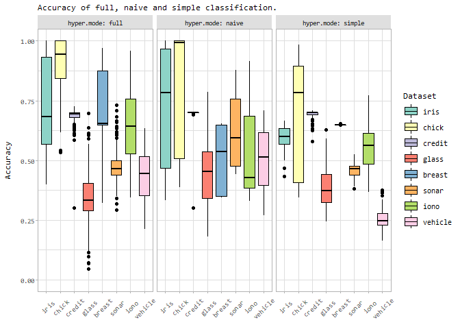

    # Now let's do the same, for Kappa
    (ggplot(gridresults_c_bc, aes(x=Dataset, y=Kappa, color=Dataset, fill=Dataset)) +
      labs(subtitle = "Kappa of full, naive and simple classification.") +
      geom_boxplot(color="black") +
      facet_wrap(hyper.mode ~ ., labeller = label_both) +
      theme_light(base_size = 9) +
      scale_color_brewer(palette = QPALETTE) +
      scale_fill_brewer(palette = QPALETTE) +
      ylim(-.1, 1) + # Some results have a negative Kappa..
      theme(
        text = element_text(family="Consolas"),
        axis.text.x = element_text(angle = 45, margin = margin(t=10), hjust = .66),
        axis.title.x = element_blank(), strip.background = element_rect(fill="#dfdfdf"),
        axis.title.y = element_text(margin = margin(r=10)),
        legend.text = element_text(size = 8),
        strip.text = element_text(color="black"))
    ) %>% saveAndPlotAsEPS("Bayes-all-datasets_Kappa")

    ## Warning: Removed 307 rows containing non-finite values (stat_boxplot).

    ## Warning: Removed 307 rows containing non-finite values (stat_boxplot).

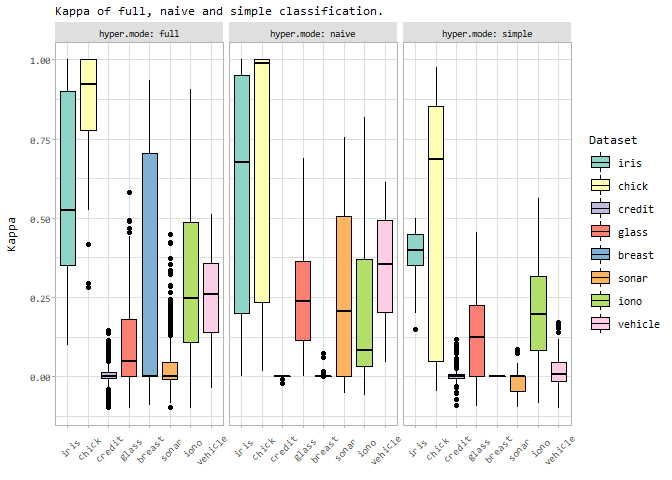

### Plot Accuracy and Kappa as compared to other Classifiers

Let’s do almost the same, but this time compare to all other trained
models as well.

    tempDsCols_c <- c("Dataset", "Model", "Accuracy", "Kappa", "Resample", "Runtime")
    gridresults_c_all <- rbind(
        gridresults_c_bc[, tempDsCols_c],
        gridresults_c_others[, tempDsCols_c])

    # Rename some models:
    gridresults_c_all$Model <- sapply(
      as.character(gridresults_c_all$Model), function(m) if (m == "bc_f") "mmb:Full" else m)
    gridresults_c_all$Model <- sapply(
      as.character(gridresults_c_all$Model), function(m) if (m == "bc_n") "mmb:Naive" else m)
    gridresults_c_all$Model <- sapply(
      as.character(gridresults_c_all$Model), function(m) if (m == "bc_s") "mmb:Simple" else m)
    gridresults_c_all$Model <- sapply(
      as.character(gridresults_c_all$Model), function(m) if (m == "null") "ZeroR" else m)

    # Next, we want to order the models:
    modelsFirst_c <- c("ZeroR", "mmb:Simple", "mmb:Full", "mmb:Naive")
    modelsFirst_c <- rev(c(
      modelsFirst_c, sort(setdiff(unique(as.character(gridresults_c_all$Model)), modelsFirst_c))))
    gridresults_c_all$Model <- factor(
      as.character(gridresults_c_all$Model), levels = modelsFirst_c, ordered = TRUE)


    facettedBoxplot <- function(dataset, metric, metricName = metric, scales = "fixed", scale_y = scale_y_continuous()) {
      ggplot(dataset, aes(y = dataset[[metric]], x = Model, fill = Model)) +
        labs(subtitle = paste("Comparison of", metricName, "against the baseline (ZeroR) and other models.")) +
        geom_boxplot(lwd = .2,
                     outlier.colour = "#666666",
                     outlier.size = 2,
                     outlier.shape = 16,
                     outlier.alpha = .75,
                     outlier.stroke = 0) +
        coord_flip() +
        facet_wrap(Dataset ~., nrow = 2, scales = scales) +
        scale_y +
        scale_color_brewer(palette = QPALETTE, guide = guide_legend(reverse = TRUE)) +
        scale_fill_brewer(palette = QPALETTE, guide = guide_legend(reverse = TRUE)) +
        labs(fill = "Method") +
        theme_light(base_size = 9) +
        theme(plot.subtitle = element_text(size = 7, margin = margin(b=5)),
              text = element_text(family="Consolas"),
              axis.text.y = element_text(margin = margin(r=5)),
              axis.title.y.left = element_blank(),
              axis.text.x = element_text(angle = 90, margin = margin(t=5), hjust = 1, vjust = .4),
              axis.title.x = element_blank(),
              legend.margin = margin(l=5),
              legend.text = element_text(size = 7),
              legend.key.height = unit(14, "pt"),
              strip.background = element_rect(fill="#dfdfdf"),
              strip.text = element_text(color="black", size = 8))
    }

Let’s make some combined Box-plots:

    facettedBoxplot(gridresults_c_all, "Accuracy") %>% saveAndPlotAsEPS("Bayes-all-datasets_bp_Accuracy", height = 3.4)

    ## Warning: Use of `dataset[[metric]]` is discouraged. Use `.data[[metric]]`
    ## instead.

    ## Warning: Use of `dataset[[metric]]` is discouraged. Use `.data[[metric]]`
    ## instead.

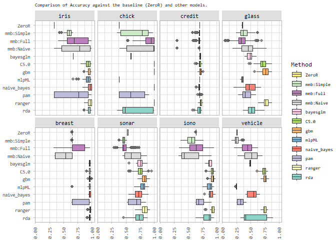

    facettedBoxplot(gridresults_c_all, "Kappa") %>% saveAndPlotAsEPS("Bayes-all-datasets_bp_Kappa", height = 3.4)

    ## Warning: Use of `dataset[[metric]]` is discouraged. Use `.data[[metric]]`
    ## instead.

    ## Warning: Use of `dataset[[metric]]` is discouraged. Use `.data[[metric]]`
    ## instead.

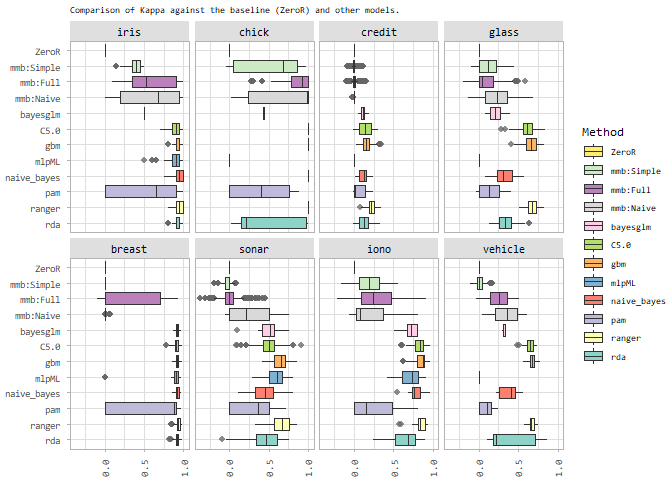

### Load the data for regression

Almost the same as for classification, only that of the time of writing,
not all results were present, so we add a check. Also, we already read
all other results, as we will be needing `ZeroR`-results already.

Now, for each dataset, we want to show the performance metrics (MAE,
RMSE, R^2) of BayesCaret (full and simple modes) vs. ZeroR. For that, we
need to create a common dataset first:

    tempDsCols_r <- c("Dataset", "Model", "RMSE", "Rsquared", "MAE", "Resample", "Runtime")
    gridresults_r_all <- rbind(
        gridresults_r_bc[, tempDsCols_r],
        gridresults_r_others[, tempDsCols_r])

    # Rename some models:
    gridresults_r_all$Model <- sapply(
      as.character(gridresults_r_all$Model), function(m) if (m == "bc_f") "mmb:Full" else m)
    gridresults_r_all$Model <- sapply(
      as.character(gridresults_r_all$Model), function(m) if (m == "bc_s") "mmb:Simple" else m)
    gridresults_r_all$Model <- sapply(
      as.character(gridresults_r_all$Model), function(m) if (m == "null") "ZeroR" else m)

    # Next, we want to order the models:
    modelsFirst_r <- c("ZeroR", "mmb:Simple", "mmb:Full")
    modelsFirst_r <- rev(c(
      modelsFirst_r, sort(setdiff(unique(as.character(gridresults_r_all$Model)), modelsFirst_r))))
    gridresults_r_all$Model <- factor(
      as.character(gridresults_r_all$Model), levels = modelsFirst_r, ordered = TRUE)

    tempDs <- do.call(rbind, lapply(datasets_r, function(d) {
      return(do.call(rbind, lapply(c(caret_models_r, "Full", "Simple", "Naive"), function(m) {
        data <- gridresults_r_all[gridresults_r_all$Model == m & gridresults_r_all$Dataset == d, ]
        if (nrow(data) == 0) return(data.frame())
        return(data.frame(
          Model = m,
          Dataset = d,
          RMSE.mean = mean(data$RMSE),
          Rsquared.mean = mean(data$Rsquared),
          MAE.mean = mean(data$MAE)
        ))
      })))
    }))

    # So it prints at least a small blue bar indicating it is actually zero..
    tempDs$Rsquared.mean <- tempDs$Rsquared.mean + 1e-2

    (ggplot(tempDs, aes(y = RMSE.mean, x = Model, fill = Model)) +
      labs(subtitle = "Comparison of RMSE.mean against the baseline (ZeroR) and other models.") +
      geom_bar(position = "dodge", stat = "identity") +
      coord_flip() +
      facet_wrap(Dataset ~., scales = "free", nrow = 2) +
      scale_color_brewer(palette = QPALETTE) +
      scale_fill_brewer(palette = QPALETTE) +
      theme_light(base_size = 9) +
      theme(text = element_text(family="Consolas"),
        axis.text.x = element_text(angle = 45, margin = margin(t=10), hjust = .66),
        axis.title.x = element_blank(), strip.background = element_rect(fill="#dfdfdf"),
        axis.title.y = element_text(margin = margin(r=10)),
        legend.text = element_text(size = 8),
        strip.text = element_text(color="black")) + labs(fill = "Method")
    ) %>% saveAndPlotAsEPS("Bayes-all-datasets_RMSE", height = 12/2.54)

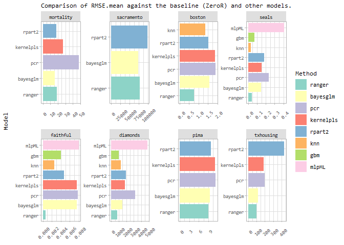

    (ggplot(tempDs, aes(y = MAE.mean, x = Model, fill = Model)) +
      labs(subtitle = "Comparison of MAE.mean against the baseline (ZeroR) and other models.") +
      geom_bar(position = "dodge", stat = "identity") +
      coord_flip() +
      facet_wrap(Dataset ~., scales = "free", nrow = 2) +
      scale_color_brewer(palette = QPALETTE) +
      scale_fill_brewer(palette = QPALETTE) +
      theme_light(base_size = 9) +
      theme(text = element_text(family="Consolas"),
        axis.text.x = element_text(angle = 45, margin = margin(t=10), hjust = .66),
        axis.title.x = element_blank(), strip.background = element_rect(fill="#dfdfdf"),
        axis.title.y = element_text(margin = margin(r=10)),
        legend.text = element_text(size = 8),
        strip.text = element_text(color="black")) + labs(fill = "Method")
    ) %>% saveAndPlotAsEPS("Bayes-all-datasets_MAE", height = 12/2.54)


    (ggplot(tempDs, aes(y = Rsquared.mean, x = Model, fill = Model)) +
      labs(subtitle = "Comparison of (R^2).mean against the baseline (ZeroR) and other models.") +
      ylab("R^2 = cov^2") +
      geom_bar(position = "dodge", stat = "identity") +
      coord_flip() +
      facet_wrap(Dataset ~., scales = "free", nrow = 2) +
      scale_color_brewer(palette = QPALETTE) +
      scale_fill_brewer(palette = QPALETTE) +
      #scale_y_sqrt() +
      theme_light(base_size = 9) +
      theme(text = element_text(family="Consolas"),
        axis.text.x = element_text(angle = 45, margin = margin(t=10), hjust = .66),
        axis.title.x = element_blank(), strip.background = element_rect(fill="#dfdfdf"),
        axis.title.y = element_text(margin = margin(r=10)),
        legend.text = element_text(size = 8),
        strip.text = element_text(color="black")) + labs(fill = "Method")
    ) %>% saveAndPlotAsEPS("Bayes-all-datasets_RSQ", height = 12/2.54)

    ## Warning: Removed 2 rows containing missing values (geom_bar).

    ## Warning: Removed 2 rows containing missing values (geom_bar).

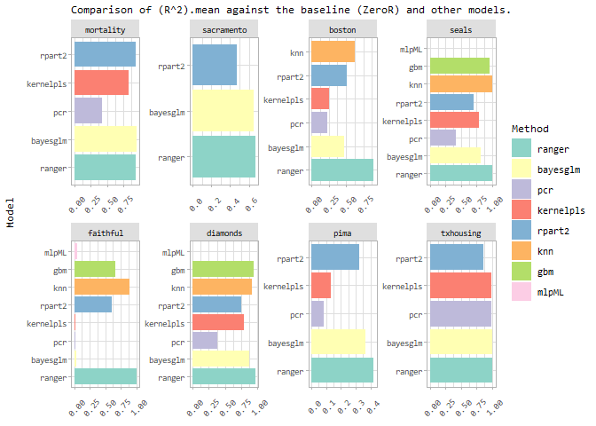

The above plots show only the mean of RMSE, R^2 and MAE. Let’s make a
facetted boxplot for each of these metrics. For that, we need to
transform and present the data in another shape.

### Plot RMSE and R^2, compared to other classifiers.

The previous plot is not terribly useful, unfortunately. Let’s show a
facetted box-plot matrix per metric instead. Also it is noteworthy, that
we trained the entire grid for our `mmb`-based models, whereas the other
models use an optimized grid. Therefore, the results of other models are
overall better, as they do not cover the entire spectrum.

    facettedBoxplot(gridresults_r_all, "Rsquared", "R^2 (cov^2)") %>% saveAndPlotAsEPS("Bayes-all-datasets_bp_RSQ", height = 3.3)

    ## Warning: Use of `dataset[[metric]]` is discouraged. Use `.data[[metric]]`
    ## instead.

    ## Warning: Removed 56 rows containing non-finite values (stat_boxplot).

    ## Warning: Use of `dataset[[metric]]` is discouraged. Use `.data[[metric]]`
    ## instead.

    ## Warning: Removed 56 rows containing non-finite values (stat_boxplot).

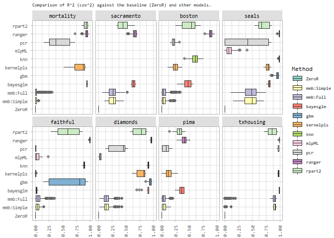

    facettedBoxplot(gridresults_r_all, "RMSE", scales = "free_x", scale_y = scale_y_log10(
      breaks = scales::trans_breaks("log10", function(x) 10^x),
      labels = scales::trans_format("log10", scales::math_format(10^.x))
    )) %>% saveAndPlotAsEPS("Bayes-all-datasets_bp_RMSE", height = 3.3)

    ## Warning: Use of `dataset[[metric]]` is discouraged. Use `.data[[metric]]`
    ## instead.

    ## Warning: Use of `dataset[[metric]]` is discouraged. Use `.data[[metric]]`
    ## instead.

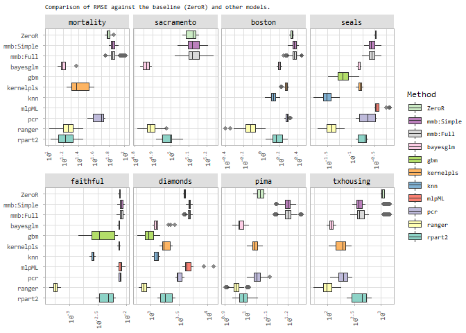

The effects of Hyperparameters
==============================

In this section, we will outline the effects of various hyperparameters
in our Bayesian models. Since the type and amount of hyperparameters
varies for classification and regression, we do them separately.

Classification
--------------

In classification, we distinguish the three modes simple, full and
naive. We have 4 hyperparameters (list below). For assessing the effect,
we relate each hyperparameter’s realization to *Accuracy*. Accuracy and
Kappa have a correlation coefficient of 0.74.

-   `shiftAmount`: Either `0` or `0.1`, so we could treat it as if it
    were boolean,
-   `retainMinValues`: Integer between `0` and 50 (0, 1, 2, 3, 4, 6, 7,
    8, 9, 10, 11, 18, 29, 35, 43, 50),
-   `doEcdf`: Boolean,
-   `online`: Integer between `0` (off) and 2147483647. Note that the
    maximum value is chosen so that all possible data is used. The
    values in use are: 0, 180, 250, 257, 421, 694, 820, 1015,
    1200, 2147483647.

Per each of the three modes, we will print a facetted density plot.

    trainCounts <- sapply(datasets_c, function(d) {
      return(nrow(get_dataset(d, 1)$train))
    })
    validCounts <- sapply(datasets_c, function(d) {
      return(nrow(get_dataset(d, 1)$valid))
    })

    gridresults_c_bc$train.size <- 0
    for (n in names(trainCounts)) {
      gridresults_c_bc[gridresults_c_bc$Dataset == n, ]$train.size <- trainCounts[[n]]
      
      # Where online == MAX, replace with actual max for dataset:
      theMax <- trainCounts[[n]] + validCounts[[n]]
      temp <- gridresults_c_bc[gridresults_c_bc$Dataset == n, ]$hyper.online
      temp <- sapply(temp, function(v) if (v == .Machine$integer.max) theMax else v)
      gridresults_c_bc[gridresults_c_bc$Dataset == n, "hyper.onlineN"] <- temp
    }


    tempDs_c <- rbind(
      data.frame(
        Acc = gridresults_c_bc$Accuracy,
        Val = gridresults_c_bc$hyper.shiftAmount + 1e-10, # avoid 0
        Var = rep("shiftAmount", nrow(gridresults_c_bc)),
        doEcdf = gridresults_c_bc$hyper.doEcdf,
        Model = gridresults_c_bc$Model
      ),
      
      data.frame(
        Acc = gridresults_c_bc$Accuracy,
        Val = (gridresults_c_bc$hyper.retainMinValues / gridresults_c_bc$train.size) + 1e-10,
        Var = rep("retainMinValues", nrow(gridresults_c_bc)),
        doEcdf = gridresults_c_bc$hyper.doEcdf,
        Model = gridresults_c_bc$Model
      ),
      
      data.frame(
        Acc = gridresults_c_bc$Accuracy,
        Val = ifelse(gridresults_c_bc$hyper.online == 0,
                     gridresults_c_bc$Accuracy * max(sqrt(gridresults_c_bc$hyper.onlineN)),
                     sqrt(gridresults_c_bc$hyper.onlineN) + 1e-10),
        Var = rep("sqrt(online)", nrow(gridresults_c_bc)),
        doEcdf = gridresults_c_bc$hyper.doEcdf,
        Model = gridresults_c_bc$Model
      )
    )

    facettedDensityPlot <- function(ds, metric, metricName = metric, form, subtitle, scale_y = scale_y_continuous(), labeller = label_both, grad_high = "#102723", grad_low = "#8DD3C7") {
      ggplot(ds, aes(x=Val, y=ds[[metric]])) +
        stat_density_2d(aes(fill = ..level..), geom="polygon", color = "white") +
        facet_grid(form, scales = "free", labeller = labeller) +
        theme_light() +
        theme(plot.subtitle = element_text(size = 7, margin = margin(b=5)),
              text = element_text(family="Consolas"),
              axis.text.x = element_text(
                angle = 90,
                margin = margin(t=5),
                hjust = 1,
                vjust = .4
              ),
              axis.title.x = element_blank(),
              axis.title.y = element_text(margin = margin(r=10), size = 7),
              strip.background = element_rect(fill="#dfdfdf"),
              strip.text = element_text(color="black", size = 8),
              legend.text = element_text(size = 7),
              legend.title = element_text(
                angle = 270,
                margin = margin(b=5),
                size = 8,
                vjust = .15
              )
        ) +
        scale_y +
        scale_fill_gradient(high = grad_high, low = grad_low) +
        labs(
          fill = "Relative\nLikelihood",
          subtitle = subtitle
        ) +
        ylab(metricName)
    }

    facettedDensityPlot(
      ds = tempDs_c[tempDs_c$Model == "bc_s",],
      metric = "Acc",
      metricName = "Accuracy",
      form = doEcdf ~ Var,
      subtitle = "Effect of Hyperparameters in simple Bayesian classification."
    ) %>% saveAndPlotAsEPS("Bayes-hps-c-simple", height = 3)

    ## Warning: Use of `ds[[metric]]` is discouraged. Use `.data[[metric]]` instead.

    ## Warning: stat_contour(): Zero contours were generated

    ## Warning in min(x): no non-missing arguments to min; returning Inf

    ## Warning in max(x): no non-missing arguments to max; returning -Inf

    ## Warning: stat_contour(): Zero contours were generated

    ## Warning in min(x): no non-missing arguments to min; returning Inf

    ## Warning in max(x): no non-missing arguments to max; returning -Inf

    ## Warning: Use of `ds[[metric]]` is discouraged. Use `.data[[metric]]` instead.

    ## Warning: stat_contour(): Zero contours were generated

    ## Warning in min(x): no non-missing arguments to min; returning Inf

    ## Warning in max(x): no non-missing arguments to max; returning -Inf

    ## Warning: stat_contour(): Zero contours were generated

    ## Warning in min(x): no non-missing arguments to min; returning Inf

    ## Warning in max(x): no non-missing arguments to max; returning -Inf

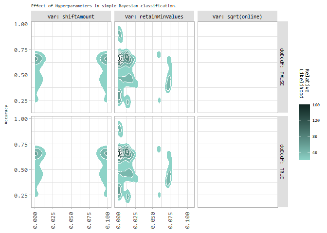

    facettedDensityPlot(
      ds = tempDs_c[tempDs_c$Model == "bc_n",],
      metric = "Acc",
      metricName = "Accuracy",
      form = doEcdf ~ Var,
      subtitle = "Effect of Hyperparameters in naive Bayesian classification."
    ) %>% saveAndPlotAsEPS("Bayes-hps-c-naive", height = 3)

    ## Warning: Use of `ds[[metric]]` is discouraged. Use `.data[[metric]]` instead.

    ## Warning: stat_contour(): Zero contours were generated

    ## Warning in min(x): no non-missing arguments to min; returning Inf

    ## Warning in max(x): no non-missing arguments to max; returning -Inf

    ## Warning: stat_contour(): Zero contours were generated

    ## Warning in min(x): no non-missing arguments to min; returning Inf

    ## Warning in max(x): no non-missing arguments to max; returning -Inf

    ## Warning: Use of `ds[[metric]]` is discouraged. Use `.data[[metric]]` instead.

    ## Warning: stat_contour(): Zero contours were generated

    ## Warning in min(x): no non-missing arguments to min; returning Inf

    ## Warning in max(x): no non-missing arguments to max; returning -Inf

    ## Warning: stat_contour(): Zero contours were generated

    ## Warning in min(x): no non-missing arguments to min; returning Inf

    ## Warning in max(x): no non-missing arguments to max; returning -Inf


    facettedDensityPlot(
      ds = tempDs_c[tempDs_c$Model == "bc_f",],
      metric = "Acc",
      metricName = "Accuracy",
      form = doEcdf ~ Var,
      subtitle = "Effect of Hyperparameters in full Bayesian classification."
    ) %>% saveAndPlotAsEPS("Bayes-hps-c-full", height = 3)

    ## Warning: Use of `ds[[metric]]` is discouraged. Use `.data[[metric]]` instead.

    ## Warning: stat_contour(): Zero contours were generated

    ## Warning in min(x): no non-missing arguments to min; returning Inf

    ## Warning in max(x): no non-missing arguments to max; returning -Inf

    ## Warning: stat_contour(): Zero contours were generated

    ## Warning in min(x): no non-missing arguments to min; returning Inf

    ## Warning in max(x): no non-missing arguments to max; returning -Inf

    ## Warning: Use of `ds[[metric]]` is discouraged. Use `.data[[metric]]` instead.

    ## Warning: stat_contour(): Zero contours were generated

    ## Warning in min(x): no non-missing arguments to min; returning Inf

    ## Warning in max(x): no non-missing arguments to max; returning -Inf

    ## Warning: stat_contour(): Zero contours were generated

    ## Warning in min(x): no non-missing arguments to min; returning Inf

    ## Warning in max(x): no non-missing arguments to max; returning -Inf

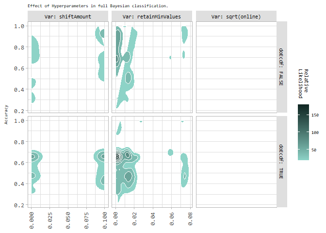

Regression
----------

For regression, there are only simple and full Bayesian models. However,
we have the following additional hyperparameters:

-   `numBuckets`: Used for discretization, the amount of ranges for
    discretization. The values in use are 5, 10 and NA. If `NA`, then
    the amount of buckets is calculated as `ceiling(log2(nrow(data)))`.
-   `sampleFromAllBuckets`: Boolean, whether to sample from all buckets.
    Otherwise, only takes the values from the most likely range/bucket.

Note that for `retainMinValues`, we use different values: 2, 4, 6, 8,
10, 11, 12, 20, 21, 26, 39, 47, 58, 101

    trainCounts_r <- sapply(datasets_r, function(d) {
      return(nrow(get_dataset(d, 1)$train))
    })
    validCounts_r <- sapply(datasets_r, function(d) {
      return(nrow(get_dataset(d, 1)$valid))
    })

    gridresults_r_bc$train.size <- 0
    for (n in names(trainCounts_r)) {
      gridresults_r_bc[gridresults_r_bc$Dataset == n, ]$train.size <- trainCounts_r[[n]]
      
      # Where online == MAX, replace with actual max for dataset:
      theMax <- trainCounts_r[[n]] + validCounts_r[[n]]
      temp <- gridresults_r_bc[gridresults_r_bc$Dataset == n, ]$hyper.online
      temp <- sapply(temp, function(v) if (v == .Machine$integer.max) theMax else v)
      gridresults_r_bc[gridresults_r_bc$Dataset == n, "hyper.onlineN"] <- temp
    }

    gridresults_r_bc$hyper.numBucketsN <- gridresults_r_bc$hyper.numBuckets
    gridresults_r_bc[is.na(gridresults_r_bc$hyper.numBuckets),]$hyper.numBucketsN <-
      ceiling(log2(gridresults_r_bc[is.na(gridresults_r_bc$hyper.numBuckets),]$train.size))

    gridresults_r_bc$Category <- ""
    for (doEcdf in c(TRUE, FALSE)) {
      for (sampleAll in c(TRUE, FALSE)) {
        theCat <- paste("ecdf:", if (doEcdf) "T" else "F", ", s.A.:", if (sampleAll) "T" else "F", sep = "")
        gridresults_r_bc[gridresults_r_bc$hyper.doEcdf == doEcdf & gridresults_r_bc$hyper.sampleFromAllBuckets == sampleAll, ]$Category <- theCat
      }
    }


    tempDs_r <- rbind(
      data.frame(
        Rsq = gridresults_r_bc$Rsquared,
        Val = gridresults_r_bc$hyper.shiftAmount + runif(nrow(gridresults_r_bc)) * 1e-10, # avoid 0
        Var = rep("shiftAmount", nrow(gridresults_r_bc)),
        Cat = gridresults_r_bc$Category,
        Model = gridresults_r_bc$Model
      ),
      
      data.frame(
        Rsq = gridresults_r_bc$Rsquared,
        Val = (gridresults_r_bc$hyper.retainMinValues / gridresults_r_bc$train.size) + 1e-10,
        Var = rep("retainMinValues", nrow(gridresults_r_bc)),
        Cat = gridresults_r_bc$Category,
        Model = gridresults_r_bc$Model
      ),
      
      data.frame(
        Rsq = gridresults_r_bc$Rsquared,
        Val = gridresults_r_bc$hyper.numBucketsN,
        Var = rep("numBuckets", nrow(gridresults_r_bc)),
        Cat = gridresults_r_bc$Category,
        Model = gridresults_r_bc$Model
      ),
      
      data.frame(
        Rsq = gridresults_r_bc$Rsquared,
        Val = ifelse(gridresults_r_bc$hyper.online == 0,
                     gridresults_r_bc$Rsquared * max(sqrt(gridresults_r_bc$hyper.onlineN)),
                     sqrt(gridresults_r_bc$hyper.onlineN) + 1e-10),
        Var = rep("sqrt(online)", nrow(gridresults_r_bc)),
        Cat = gridresults_r_bc$Category,
        Model = gridresults_r_bc$Model
      )
    )

    facettedDensityPlot(
      ds = tempDs_r[tempDs_r$Model == "bc_s",],
      metric = "Rsq",
      metricName = "R^2 = cov^2",
      form = Cat ~ Var,
      subtitle ="Effect of Hyperparameters in simple Bayesian regression.",
      grad_high = "#2C2749",
      grad_low = "#BEBADA",
      scale_y = scale_y_sqrt()
    ) %>% saveAndPlotAsEPS("Bayes-hps-r-simple", height = 4.6)

    ## Warning: Use of `ds[[metric]]` is discouraged. Use `.data[[metric]]` instead.

    ## Warning: stat_contour(): Zero contours were generated

    ## Warning in min(x): no non-missing arguments to min; returning Inf

    ## Warning in max(x): no non-missing arguments to max; returning -Inf

    ## Warning: stat_contour(): Zero contours were generated

    ## Warning in min(x): no non-missing arguments to min; returning Inf

    ## Warning in max(x): no non-missing arguments to max; returning -Inf

    ## Warning: stat_contour(): Zero contours were generated

    ## Warning in min(x): no non-missing arguments to min; returning Inf

    ## Warning in max(x): no non-missing arguments to max; returning -Inf

    ## Warning: stat_contour(): Zero contours were generated

    ## Warning in min(x): no non-missing arguments to min; returning Inf

    ## Warning in max(x): no non-missing arguments to max; returning -Inf

    ## Warning: stat_contour(): Zero contours were generated

    ## Warning in min(x): no non-missing arguments to min; returning Inf

    ## Warning in max(x): no non-missing arguments to max; returning -Inf

    ## Warning: stat_contour(): Zero contours were generated

    ## Warning in min(x): no non-missing arguments to min; returning Inf

    ## Warning in max(x): no non-missing arguments to max; returning -Inf

    ## Warning: stat_contour(): Zero contours were generated

    ## Warning in min(x): no non-missing arguments to min; returning Inf

    ## Warning in max(x): no non-missing arguments to max; returning -Inf

    ## Warning: stat_contour(): Zero contours were generated

    ## Warning in min(x): no non-missing arguments to min; returning Inf

    ## Warning in max(x): no non-missing arguments to max; returning -Inf

    ## Warning: Use of `ds[[metric]]` is discouraged. Use `.data[[metric]]` instead.

    ## Warning: stat_contour(): Zero contours were generated

    ## Warning in min(x): no non-missing arguments to min; returning Inf

    ## Warning in max(x): no non-missing arguments to max; returning -Inf

    ## Warning: stat_contour(): Zero contours were generated

    ## Warning in min(x): no non-missing arguments to min; returning Inf

    ## Warning in max(x): no non-missing arguments to max; returning -Inf

    ## Warning: stat_contour(): Zero contours were generated

    ## Warning in min(x): no non-missing arguments to min; returning Inf

    ## Warning in max(x): no non-missing arguments to max; returning -Inf

    ## Warning: stat_contour(): Zero contours were generated

    ## Warning in min(x): no non-missing arguments to min; returning Inf

    ## Warning in max(x): no non-missing arguments to max; returning -Inf

    ## Warning: stat_contour(): Zero contours were generated

    ## Warning in min(x): no non-missing arguments to min; returning Inf

    ## Warning in max(x): no non-missing arguments to max; returning -Inf

    ## Warning: stat_contour(): Zero contours were generated

    ## Warning in min(x): no non-missing arguments to min; returning Inf

    ## Warning in max(x): no non-missing arguments to max; returning -Inf

    ## Warning: stat_contour(): Zero contours were generated

    ## Warning in min(x): no non-missing arguments to min; returning Inf

    ## Warning in max(x): no non-missing arguments to max; returning -Inf

    ## Warning: stat_contour(): Zero contours were generated

    ## Warning in min(x): no non-missing arguments to min; returning Inf

    ## Warning in max(x): no non-missing arguments to max; returning -Inf

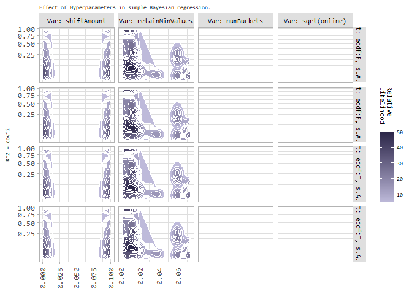

    facettedDensityPlot(
      ds = tempDs_r[tempDs_r$Model == "bc_f",],
      metric = "Rsq",
      metricName = "R^2 = cov^2",
      form = Cat ~ Var,
      subtitle ="Effect of Hyperparameters in full Bayesian regression.",
      grad_high = "#2C2749",
      grad_low = "#BEBADA",
      scale_y = scale_y_sqrt()
    ) %>% saveAndPlotAsEPS("Bayes-hps-r-full", height = 4.6)

    ## Warning: Use of `ds[[metric]]` is discouraged. Use `.data[[metric]]` instead.

    ## Warning: stat_contour(): Zero contours were generated

    ## Warning in min(x): no non-missing arguments to min; returning Inf

    ## Warning in max(x): no non-missing arguments to max; returning -Inf

    ## Warning: stat_contour(): Zero contours were generated

    ## Warning in min(x): no non-missing arguments to min; returning Inf

    ## Warning in max(x): no non-missing arguments to max; returning -Inf

    ## Warning: stat_contour(): Zero contours were generated

    ## Warning in min(x): no non-missing arguments to min; returning Inf

    ## Warning in max(x): no non-missing arguments to max; returning -Inf

    ## Warning: stat_contour(): Zero contours were generated

    ## Warning in min(x): no non-missing arguments to min; returning Inf

    ## Warning in max(x): no non-missing arguments to max; returning -Inf

    ## Warning: stat_contour(): Zero contours were generated

    ## Warning in min(x): no non-missing arguments to min; returning Inf

    ## Warning in max(x): no non-missing arguments to max; returning -Inf

    ## Warning: stat_contour(): Zero contours were generated

    ## Warning in min(x): no non-missing arguments to min; returning Inf

    ## Warning in max(x): no non-missing arguments to max; returning -Inf

    ## Warning: stat_contour(): Zero contours were generated

    ## Warning in min(x): no non-missing arguments to min; returning Inf

    ## Warning in max(x): no non-missing arguments to max; returning -Inf

    ## Warning: stat_contour(): Zero contours were generated

    ## Warning in min(x): no non-missing arguments to min; returning Inf

    ## Warning in max(x): no non-missing arguments to max; returning -Inf

    ## Warning: stat_contour(): Zero contours were generated

    ## Warning in min(x): no non-missing arguments to min; returning Inf

    ## Warning in max(x): no non-missing arguments to max; returning -Inf

    ## Warning: stat_contour(): Zero contours were generated

    ## Warning in min(x): no non-missing arguments to min; returning Inf

    ## Warning in max(x): no non-missing arguments to max; returning -Inf

    ## Warning: stat_contour(): Zero contours were generated

    ## Warning in min(x): no non-missing arguments to min; returning Inf

    ## Warning in max(x): no non-missing arguments to max; returning -Inf

    ## Warning: stat_contour(): Zero contours were generated

    ## Warning in min(x): no non-missing arguments to min; returning Inf

    ## Warning in max(x): no non-missing arguments to max; returning -Inf

    ## Warning: stat_contour(): Zero contours were generated

    ## Warning in min(x): no non-missing arguments to min; returning Inf

    ## Warning in max(x): no non-missing arguments to max; returning -Inf

    ## Warning: stat_contour(): Zero contours were generated

    ## Warning in min(x): no non-missing arguments to min; returning Inf

    ## Warning in max(x): no non-missing arguments to max; returning -Inf

    ## Warning: Use of `ds[[metric]]` is discouraged. Use `.data[[metric]]` instead.

    ## Warning: stat_contour(): Zero contours were generated

    ## Warning in min(x): no non-missing arguments to min; returning Inf

    ## Warning in max(x): no non-missing arguments to max; returning -Inf

    ## Warning: stat_contour(): Zero contours were generated

    ## Warning in min(x): no non-missing arguments to min; returning Inf

    ## Warning in max(x): no non-missing arguments to max; returning -Inf

    ## Warning: stat_contour(): Zero contours were generated

    ## Warning in min(x): no non-missing arguments to min; returning Inf

    ## Warning in max(x): no non-missing arguments to max; returning -Inf

    ## Warning: stat_contour(): Zero contours were generated

    ## Warning in min(x): no non-missing arguments to min; returning Inf

    ## Warning in max(x): no non-missing arguments to max; returning -Inf

    ## Warning: stat_contour(): Zero contours were generated

    ## Warning in min(x): no non-missing arguments to min; returning Inf

    ## Warning in max(x): no non-missing arguments to max; returning -Inf

    ## Warning: stat_contour(): Zero contours were generated

    ## Warning in min(x): no non-missing arguments to min; returning Inf

    ## Warning in max(x): no non-missing arguments to max; returning -Inf

    ## Warning: stat_contour(): Zero contours were generated

    ## Warning in min(x): no non-missing arguments to min; returning Inf

    ## Warning in max(x): no non-missing arguments to max; returning -Inf

    ## Warning: stat_contour(): Zero contours were generated

    ## Warning in min(x): no non-missing arguments to min; returning Inf

    ## Warning in max(x): no non-missing arguments to max; returning -Inf

    ## Warning: stat_contour(): Zero contours were generated

    ## Warning in min(x): no non-missing arguments to min; returning Inf

    ## Warning in max(x): no non-missing arguments to max; returning -Inf

    ## Warning: stat_contour(): Zero contours were generated

    ## Warning in min(x): no non-missing arguments to min; returning Inf

    ## Warning in max(x): no non-missing arguments to max; returning -Inf

    ## Warning: stat_contour(): Zero contours were generated

    ## Warning in min(x): no non-missing arguments to min; returning Inf

    ## Warning in max(x): no non-missing arguments to max; returning -Inf

    ## Warning: stat_contour(): Zero contours were generated

    ## Warning in min(x): no non-missing arguments to min; returning Inf

    ## Warning in max(x): no non-missing arguments to max; returning -Inf

    ## Warning: stat_contour(): Zero contours were generated

    ## Warning in min(x): no non-missing arguments to min; returning Inf

    ## Warning in max(x): no non-missing arguments to max; returning -Inf

    ## Warning: stat_contour(): Zero contours were generated

    ## Warning in min(x): no non-missing arguments to min; returning Inf

    ## Warning in max(x): no non-missing arguments to max; returning -Inf

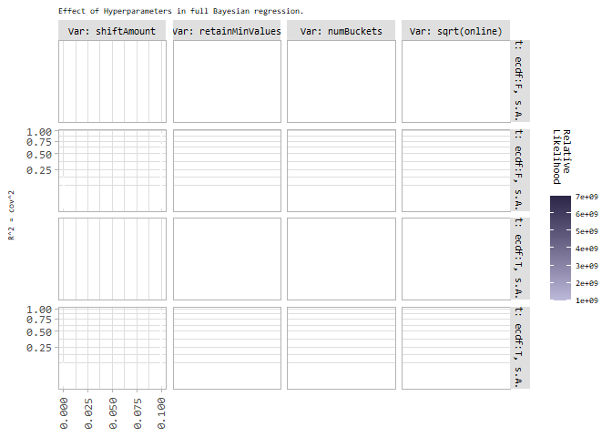

As can be seen in the above plot, we do not get great visual results for
`shiftAmount` if `sampleFromAllBuckets=TRUE`, so let’s plot it again w/o
this column:

    facettedDensityPlot(
      ds = tempDs_r[tempDs_r$Model == "bc_f" & tempDs_r$Var != "shiftAmount",],
      metric = "Rsq",
      metricName = "R^2 = cov^2",
      form = Cat ~ Var,
      subtitle ="Effect of Hyperparameters in full Bayesian regression.",
      scale_y = scale_y_sqrt(),
      grad_high = "#2C2749",
      grad_low = "#BEBADA",
      labeller = labeller(Cat = c(
        "ecdf:F, s.A.:F" = "ecdf:F, sA:F",
        "ecdf:F, s.A.:T" = "ecdf:F, sA:T",
        "ecdf:T, s.A.:F" = "ecdf:T, sA:F",
        "ecdf:T, s.A.:T" = "ecdf:T, sA:T"
      ))
    ) %>% saveAndPlotAsEPS("Bayes-hps-r-full", height = 4.6)

    ## Warning: Use of `ds[[metric]]` is discouraged. Use `.data[[metric]]` instead.

    ## Warning: stat_contour(): Zero contours were generated

    ## Warning in min(x): no non-missing arguments to min; returning Inf

    ## Warning in max(x): no non-missing arguments to max; returning -Inf

    ## Warning: stat_contour(): Zero contours were generated

    ## Warning in min(x): no non-missing arguments to min; returning Inf

    ## Warning in max(x): no non-missing arguments to max; returning -Inf

    ## Warning: stat_contour(): Zero contours were generated

    ## Warning in min(x): no non-missing arguments to min; returning Inf

    ## Warning in max(x): no non-missing arguments to max; returning -Inf

    ## Warning: stat_contour(): Zero contours were generated

    ## Warning in min(x): no non-missing arguments to min; returning Inf

    ## Warning in max(x): no non-missing arguments to max; returning -Inf

    ## Warning: stat_contour(): Zero contours were generated

    ## Warning in min(x): no non-missing arguments to min; returning Inf

    ## Warning in max(x): no non-missing arguments to max; returning -Inf

    ## Warning: stat_contour(): Zero contours were generated

    ## Warning in min(x): no non-missing arguments to min; returning Inf

    ## Warning in max(x): no non-missing arguments to max; returning -Inf

    ## Warning: stat_contour(): Zero contours were generated

    ## Warning in min(x): no non-missing arguments to min; returning Inf

    ## Warning in max(x): no non-missing arguments to max; returning -Inf

    ## Warning: stat_contour(): Zero contours were generated

    ## Warning in min(x): no non-missing arguments to min; returning Inf

    ## Warning in max(x): no non-missing arguments to max; returning -Inf

    ## Warning: Use of `ds[[metric]]` is discouraged. Use `.data[[metric]]` instead.

    ## Warning: stat_contour(): Zero contours were generated

    ## Warning in min(x): no non-missing arguments to min; returning Inf

    ## Warning in max(x): no non-missing arguments to max; returning -Inf

    ## Warning: stat_contour(): Zero contours were generated

    ## Warning in min(x): no non-missing arguments to min; returning Inf

    ## Warning in max(x): no non-missing arguments to max; returning -Inf

    ## Warning: stat_contour(): Zero contours were generated

    ## Warning in min(x): no non-missing arguments to min; returning Inf

    ## Warning in max(x): no non-missing arguments to max; returning -Inf

    ## Warning: stat_contour(): Zero contours were generated

    ## Warning in min(x): no non-missing arguments to min; returning Inf

    ## Warning in max(x): no non-missing arguments to max; returning -Inf

    ## Warning: stat_contour(): Zero contours were generated

    ## Warning in min(x): no non-missing arguments to min; returning Inf

    ## Warning in max(x): no non-missing arguments to max; returning -Inf

    ## Warning: stat_contour(): Zero contours were generated

    ## Warning in min(x): no non-missing arguments to min; returning Inf

    ## Warning in max(x): no non-missing arguments to max; returning -Inf

    ## Warning: stat_contour(): Zero contours were generated

    ## Warning in min(x): no non-missing arguments to min; returning Inf

    ## Warning in max(x): no non-missing arguments to max; returning -Inf

    ## Warning: stat_contour(): Zero contours were generated

    ## Warning in min(x): no non-missing arguments to min; returning Inf

    ## Warning in max(x): no non-missing arguments to max; returning -Inf

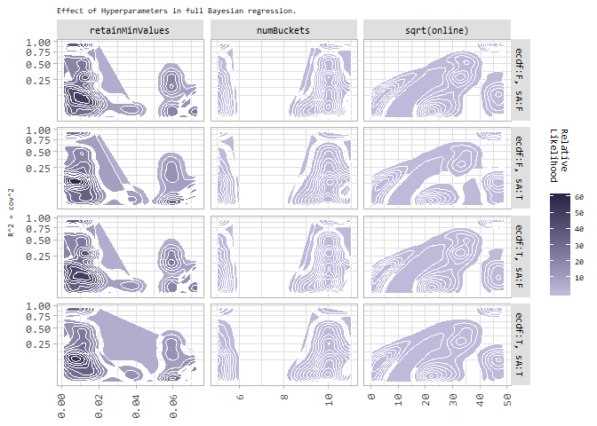

Neighborhood Search
-------------------

The evaluation for the Neighborhood Search is two-fold. The first part
is an analytical approach, while in the second part, we do a visual
evaluation, based on dimensionality reduction.

### Analytical Evaluation

In this section, we will focus on evaluating how the hyperparameters
affect the vicinity of randomly chosen samples and their neighborhood.
Assigning the vicinity to a dataset based on the attributes of a
randomly chosen sample can be thought of selecting those samples, that
are close to the random sample. All other samples should be classified
as not relevant. We will therefore design an evaluation where the
assigned vicinity is used as a binary classifier. We then measure which
of the samples are classified to be in the neighborhood (here: same
class) using accuracy, Kappa, F1, precision and recall.

This will require us to do some grid-searching again. For that, we
define the grid manually and then run it across the classification
datasets.

    #get_other_models_results(modelsAndDatasets = df)
    get_vicinity_results <- function(hpsAndDatasets = data.frame()) {
      dataName <- paste("results_n/vicinities.csv", sep = "")
      if (file.exists(dataName)) {
        return(read.csv(dataName))
      }
      
      if (DISABLE_COMPUTATIONS) {
        return(0)
      }
      
      # shuffle deterministically
      perms <- hpsAndDatasets[order(hpsAndDatasets$dataset), ]
      set.seed(0xbeef42)
      perms <- perms[sample(rownames(perms)), ]
      
      
      numCores <- parallel::detectCores()
      cl <- parallel::makeCluster(round(numCores * 1.25), outfile = "")
      clusterExport(cl, as.list(names(.GlobalEnv)))
      registerDoSNOW(cl)
      pb <- txtProgressBar(min = 0, max = nrow(perms), style = 3)
      
      
      allResults <- foreach(
        permRowIdx = rownames(perms),
        .combine = rbind,
        .packages = packages_required,
        .options.snow = list(
          progress = function(n) {
            writeLines(paste(n, Sys.time(), sep = "  --  "), con = "progress.txt")
            setTxtProgressBar(pb, n)
          }
        )
      ) %dopar% {
        permRow <- perms[permRowIdx, ]
        dsList <- get_dataset(permRow$dataset, seedMult = permRow$seedMult)
        
        # Let's choose a random sample from the dataset. All other samples
        # carrying the same label will be marked as "1" (included), and all
        # other samples will be marked "0". The vicinity should assign an
        # "0" to all samples not having the same label, and that's what we measure.
        
        df <- dsList$ds[,]
        # Pick the sample and then assign "1" and "0":
        s <- df[sample(rownames(df), 1), ]
        s$vicGroup <- 1
        df$vicGroup <- 0
        df[df[[dsList$label]] == s[[dsList$label]], ]$vicGroup <- 1
        
        selFeats <- colnames(s)[!(colnames(s) %in% c(dsList$label, "vicGroup"))]
        
        vic <- mmb::vicinitiesForSample(
          df = df[, selFeats],
          sampleFromDf = s[, selFeats, ],
          selectedFeatureNames = selFeats,
          shiftAmount = permRow$shiftAmount,
          doEcdf = permRow$doEcdf,
          ecdfMinusOne = permRow$ecdfMinusOne,
          retainMinValues = permRow$retainMinValues
        )
        
        # The ground-truth is now in df$vicGroup, and we assign the
        # group again where vic > 0. Actually, for shiftAmount > 0,
        # the condition is vic > shiftAmount^length(selFeats).
        vicMin <- permRow$shiftAmount^length(selFeats)
        gt <- df$vicGroup
        pred <- sapply(vic$vicinity, function(v) {
          if (v > vicMin) return(1)
          return(0)
        })
        
        permRow$Precision <- Metrics::precision(gt, pred)
        permRow$Recall <- Metrics::recall(gt, pred)
        permRow$F1 <- Metrics::f1(gt, pred)
        permRow$Fbeta <- Metrics::fbeta_score(gt, pred)
        permRow$Accuracy <- Metrics::accuracy(gt, pred)
        permRow$Kappa <- Metrics::ScoreQuadraticWeightedKappa(gt, pred)
        permRow$AUC <- Metrics::auc(gt, pred)
        
        return(permRow)
      }
      
      stopCluster(cl)
      registerDoSEQ()
      
      write.csv(allResults, dataName)
      return(allResults)
    }

Do the computation for all sets of hyperparameters and datasets:

    set.seed(42)
    hpsAndDatasets <- expand.grid(
      Dataset = datasets_c,
      seedMult = sample.int(.Machine$integer.max, 25),
      hyper.shiftAmount = c(0, 0.1, 1),
      hyper.doEcdf = c(TRUE, FALSE),
      hyper.ecdfMinusOne = c(TRUE, FALSE),
      hyper.retainMinValues = c(0, 1, 3, 5, 10)
    )
    # Remove some cases that make no sense:
    hpsAndDatasets <- hpsAndDatasets[!(hpsAndDatasets$hyper.ecdfMinusOne & !hpsAndDatasets$hyper.doEcdf), ]

    gridresults_n <- get_vicinity_results(hpsAndDatasets)

Some evaluation:

    # Let's show some boxplots per dataset and metric!
    tempDs_n <- rbind(
      data.frame(
        Val = gridresults_n$Precision,
        Metric = rep("Precision", nrow(gridresults_n)),
        Dataset = gridresults_n$Dataset
      ),
      
      data.frame(
        Val = gridresults_n$Recall,
        Metric = rep("Recall", nrow(gridresults_n)),
        Dataset = gridresults_n$Dataset
      ),
      
      data.frame(
        Val = gridresults_n$F1,
        Metric = rep("F1", nrow(gridresults_n)),
        Dataset = gridresults_n$Dataset
      ),
      
      data.frame(
        Val = gridresults_n$Fbeta,
        Metric = rep("Fbeta", nrow(gridresults_n)),
        Dataset = gridresults_n$Dataset
      ),
      
      data.frame(
        Val = gridresults_n$Accuracy,
        Metric = rep("Accuracy", nrow(gridresults_n)),
        Dataset = gridresults_n$Dataset
      ),
      
      data.frame(
        Val = gridresults_n$Kappa,
        Metric = rep("Kappa", nrow(gridresults_n)),
        Dataset = gridresults_n$Dataset
      ),
      
      data.frame(
        Val = gridresults_n$AUC,
        Metric = rep("AUC", nrow(gridresults_n)),
        Dataset = gridresults_n$Dataset
      )
    )

    # We should assign a good order to the metrics:
    tempDs_n$Metric <- factor(x = as.character(tempDs_n$Metric), levels = c("Accuracy", "Kappa", "Precision", "Recall", "F1", "Fbeta", "AUC"), ordered = TRUE)


    (ggplot(tempDs_n, aes(y = Val, x = Metric, fill = Metric)) +
      labs(subtitle = paste("Comparison of various metrics using mmb::vicinity() as a binary classifier.")) +
      geom_boxplot(lwd = .2,
                   outlier.colour = "#666666",
                   outlier.size = 2,
                   outlier.shape = 16,
                   outlier.alpha = .75,
                   outlier.stroke = 0) +
      facet_wrap(Dataset ~., nrow = 2, scales = "free_x") +
      coord_flip() +
      scale_color_brewer(palette = QPALETTE) +
      scale_fill_brewer(palette = QPALETTE) +
      labs(fill = "Metric") +
      theme_light(base_size = 9) +
      theme(plot.subtitle = element_text(size = 7, margin = margin(b=5)),
            text = element_text(family="Consolas"),
            axis.text.y = element_text(margin = margin(r=5)),
            axis.title.y.left = element_blank(),
            axis.text.x = element_text(
              angle = 90, margin = margin(t=5), hjust = 1, vjust = .4),
            axis.title.x = element_blank(),
            legend.margin = margin(l=5),
            legend.text = element_text(size = 7),
            legend.key.height = unit(14, "pt"),
            panel.spacing.y = unit(1, "lines"),
            strip.background = element_rect(fill="#dfdfdf"),
            strip.text = element_text(color="black", size = 8))
    ) %>% saveAndPlotAsEPS("Bayes-all-datasets_bp_vicinity", height = 3.2)

    ## Warning: Removed 2975 rows containing non-finite values (stat_boxplot).

    ## Warning: Removed 2975 rows containing non-finite values (stat_boxplot).

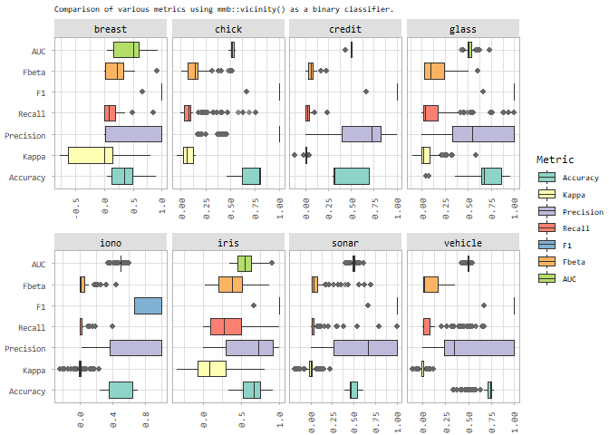

What is left is to show how each hyperparameter affects the metrics. We
have a handfull metrics but let’s make an evaluation for the metric with
the greatest variance:

    metricVar <- unlist(lapply(unique(as.character(tempDs_n$Metric)), function(m) {
      temp <- list()
      temp[[m]] <- var(abs(gridresults_n[[m]]), na.rm = TRUE)
      return(temp)
    }))

    metricVarMax <- names(which.max(metricVar))

The metric with the greatest variance is Precision.

    # Let's first introduce a category based on our two booleans:
    gridresults_n$Category <- ""
    for (doEcdf in c(TRUE, FALSE)) {
      for (ecdfMinusOne in c(TRUE, FALSE)) {
        temp <- gridresults_n[gridresults_n$hyper.doEcdf == doEcdf & gridresults_n$hyper.ecdfMinusOne == ecdfMinusOne, ]
        if (nrow(temp) == 0) next
        
        theCat <- paste("ecdf:", if (doEcdf) "T" else "F", ", e-1:", if (ecdfMinusOne) "T" else "F", sep = "")
        gridresults_n[gridresults_n$hyper.doEcdf == doEcdf & gridresults_n$hyper.ecdfMinusOne == ecdfMinusOne, ]$Category <- theCat
      }
    }

    tempDsHp_n <- rbind(
      data.frame(
        Metric = gridresults_n[[metricVarMax]],
        Val = gridresults_n$hyper.shiftAmount + runif(nrow(gridresults_n)) * 1e-10,
        Var = rep("shiftAmount", nrow(gridresults_n)),
        Cat = gridresults_n$Category
      ),
      
      data.frame(
        Metric = gridresults_n[[metricVarMax]],
        Val = gridresults_n$hyper.retainMinValues,
        Var = rep("retainMinValues", nrow(gridresults_n)),
        Cat = gridresults_n$Category
      )
    )

    (facettedDensityPlot(
      ds = tempDsHp_n,
      metric = "Metric",
      metricName = metricVarMax,
      form = Cat ~ Var,
      subtitle = paste("Effect of Hyperparameters on", metricVarMax, "using mmb::vicinity() as a binary classifier."),
      grad_high = "#142C3A",
      grad_low = "#80B1D3",
      labeller = labeller(Cat = c(
        "ecdf:F, e-1:F" = "ecdf:F",
        "ecdf:T, e-1:F" = "ecdf:T, e-1:F",
        "ecdf:T, e-1:T" = "ecdf:T, e-1:T"
      )))
    ) %>% saveAndPlotAsEPS(paste("Bayes-hps-n-vicinity", metricVarMax, sep = "_"), height = 3.7)

    ## Warning: Use of `ds[[metric]]` is discouraged. Use `.data[[metric]]` instead.

    ## Warning: Removed 2876 rows containing non-finite values (stat_density2d).

    ## Warning: stat_contour(): Zero contours were generated

    ## Warning in min(x): no non-missing arguments to min; returning Inf

    ## Warning in max(x): no non-missing arguments to max; returning -Inf

    ## Warning: Use of `ds[[metric]]` is discouraged. Use `.data[[metric]]` instead.

    ## Warning: Removed 2876 rows containing non-finite values (stat_density2d).

    ## Warning: stat_contour(): Zero contours were generated

    ## Warning in min(x): no non-missing arguments to min; returning Inf

    ## Warning in max(x): no non-missing arguments to max; returning -Inf

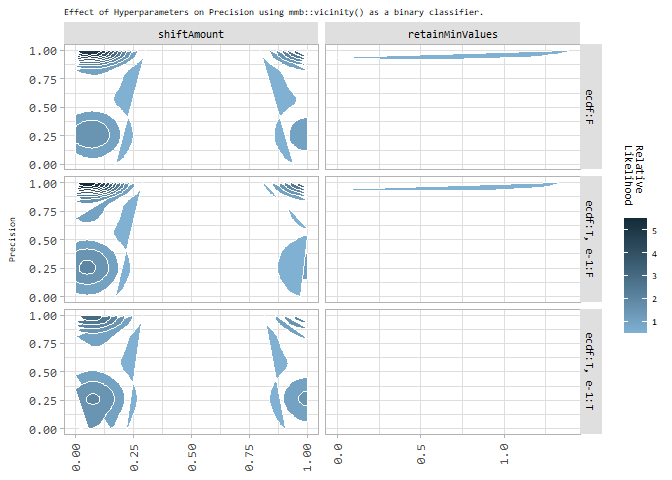

    tempDsHp_n <- rbind(
      data.frame(
        Metric = gridresults_n$Accuracy,
        Val = gridresults_n$hyper.shiftAmount + runif(nrow(gridresults_n)) * 1e-10,
        Var = rep("shiftAmount", nrow(gridresults_n)),
        Cat = gridresults_n$Category
      ),
      
      data.frame(
        Metric = gridresults_n$Accuracy,
        Val = gridresults_n$hyper.retainMinValues,
        Var = rep("retainMinValues", nrow(gridresults_n)),
        Cat = gridresults_n$Category
      )
    )

    # Let's do the same for accuracy:
    (facettedDensityPlot(
      ds = tempDsHp_n,
      metric = "Metric",
      metricName = "Accuracy",
      form = Cat ~ Var,
      subtitle = paste("Effect of Hyperparameters on Accuracy using mmb::vicinity() as a binary classifier."),
      scale_y = scale_y_continuous(),
      grad_high = "#142C3A",
      grad_low = "#80B1D3",
      labeller = labeller(Cat = c(
        "ecdf:F, e-1:F" = "ecdf:F",
        "ecdf:T, e-1:F" = "ecdf:T, e-1:F",
        "ecdf:T, e-1:T" = "ecdf:T, e-1:T"
      )))
    ) %>% saveAndPlotAsEPS("Bayes-hps-n-vicinity_Accuracy", height = 3.7)

    ## Warning: Use of `ds[[metric]]` is discouraged. Use `.data[[metric]]` instead.

    ## Warning: stat_contour(): Zero contours were generated

    ## Warning in min(x): no non-missing arguments to min; returning Inf

    ## Warning in max(x): no non-missing arguments to max; returning -Inf

    ## Warning: stat_contour(): Zero contours were generated

    ## Warning in min(x): no non-missing arguments to min; returning Inf

    ## Warning in max(x): no non-missing arguments to max; returning -Inf

    ## Warning: stat_contour(): Zero contours were generated

    ## Warning in min(x): no non-missing arguments to min; returning Inf

    ## Warning in max(x): no non-missing arguments to max; returning -Inf

    ## Warning: Use of `ds[[metric]]` is discouraged. Use `.data[[metric]]` instead.

    ## Warning: stat_contour(): Zero contours were generated

    ## Warning in min(x): no non-missing arguments to min; returning Inf

    ## Warning in max(x): no non-missing arguments to max; returning -Inf

    ## Warning: stat_contour(): Zero contours were generated

    ## Warning in min(x): no non-missing arguments to min; returning Inf

    ## Warning in max(x): no non-missing arguments to max; returning -Inf

    ## Warning: stat_contour(): Zero contours were generated

    ## Warning in min(x): no non-missing arguments to min; returning Inf

    ## Warning in max(x): no non-missing arguments to max; returning -Inf

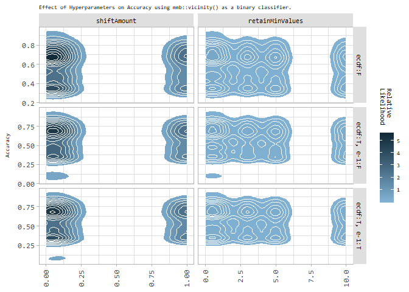

### Visual Evaluation using `t-SNE`

In dimensionality reduction, a high-dimensional sample-space is reduced
to fewer dimensions. Using `t-SNE`, the reduction is usually done
towards 2 dimensions, so that they can be plotted. While the Cartesian
coordinates do not have a meaning, we expect to see correct clustering.
In other words, a good result is when samples that are close in
high-dimensional space are still close in a lower dimensional space
(here: 2).

We attempt to validate clusters of the `iris`-dataset, as its clusters,
which correspond to the species, are well separated. In the following
tests, we attempt to pick a random sample from `iris`, and then
calculate its neighborhood, thus selecting all other samples with a
vicinity greater zero. For comparison, we also compute the *Euclidean*
distance and then draw our conclusions.

    # Well show the following plots:
    # - the raw t-SNE result/plot
    # - the t-SNE plot with gradient color, according to the vicinities
    # - the plot with a discretized vicinity (number of buckets == number of classes)
    # - the plot with binary vicinity
    # - the plot with euclidean-vicinity

    set.seed(1)
    chooseSample <- 123
    shiftAmount <- 0.1

    df <- iris[sample(rownames(iris)), ]
    df$Species <- as.factor(sapply(df$Species, function(l) {
      if (l == "setosa") return("set.") else if (l == "versicolor") return("vers.") else return("virg.")
    }))
    dsCols <- colnames(iris)[1:4]
    tsne <- Rtsne::Rtsne(df[, dsCols], check_duplicates = FALSE)
    # Attach:
    df$X <- tsne$Y[, 1]
    df$Y <- tsne$Y[, 2]

    # Let's pick one sample to calculate the vicinity for:
    s <- df[chooseSample, dsCols]
    vics <- mmb::vicinitiesForSample(doEcdf = FALSE, shiftAmount = shiftAmount,
      df = df[, dsCols], sampleFromDf = s, selectedFeatureNames = colnames(s),
      retainMinValues = 0)

    vicMin <- shiftAmount^length(colnames(s))

    # Attach to df:
    df$vics <- vics$vicinity
    # TEMP TEMP TEMP: Discretize vics
    mmbd <- mmb::discretizeVariableToRanges(df$vics, numRanges = length(levels(df$Species)))
    df$vicsD <- sapply(df$vics, function(v) {
      for (i in 1:length(mmbd)) {
        r <- mmbd[[i]]
        if (v >= r[1] && v < r[2]) return(paste("R", i, sep = ""))
      }
    })

    # Also, create a binary classification:
    df$vicsB <- sapply(df$vics, function(v) {
      return(if (v > vicMin) "Incl." else "Excl.")
    })

    # Additionally, compute the Euclidean-distance:
    df$eucl <- as.vector(philentropy::distance(df[, dsCols])[1,])

    ## Metric: 'euclidean'; comparing: 150 vectors.

    df$eucl <- max(df$eucl) - df$eucl

    # .. and another distance:
    df$cos <- as.vector(philentropy::distance(df[, dsCols], method = "cosine")[1,])

    ## Metric: 'cosine'; comparing: 150 vectors.

    df$cos <- max(df$cos) - df$cos

    # and two more:

    df$taneja <- as.vector(philentropy::distance(df[, dsCols], method = "taneja")[1,])

    ## Metric: 'taneja' using unit: 'log'; comparing: 150 vectors.

    df$taneja <- max(df$taneja) - df$taneja

    df$ruz <- as.vector(philentropy::distance(df[, dsCols], method = "ruzicka")[1,])

    ## Metric: 'ruzicka'; comparing: 150 vectors.

    df$ruz <- max(df$ruz) - df$ruz


    themeCommon <- theme_light(base_size = 9) + theme(
      legend.position = "bottom",
      axis.title.x.bottom = element_blank(),
      axis.title.y.left = element_blank(),
      legend.title = element_blank(),
      axis.text.x = element_blank(),
      axis.text.y = element_blank(),
      plot.subtitle = element_text(size = 7, margin = margin(b=5))
    )

    pointCommon <- geom_point(
      shape=25, size=1.5, color="black", fill="cyan",
      data=df[chooseSample,],
      mapping=aes(x=df[chooseSample,]$X, y=df[chooseSample,]$Y))


    g1 <- ggplot(df, aes(x=X, y=Y, color=Species)) +
      geom_point(size = .5) +
      stat_ellipse() +
      pointCommon +
      themeCommon +
      labs(subtitle = "2D t-SNE embedding.")

    g2 <- ggplot(df, aes(x=X, y=Y)) +
      geom_point(size = .5, aes(color=vics)) +
      scale_color_viridis_c() +
      pointCommon +
      themeCommon +
      labs(subtitle = "mmb-vicninities for sample.")

    g3 <- ggplot(df, aes(x=X, y=Y, color=vicsD)) +
      geom_point(size = .5) +
      pointCommon +
      themeCommon +
      labs(subtitle = "mmb discrete vicinities.")

    g4 <- ggplot(df, aes(x=X, y=Y, color=vicsB)) +
      geom_point(size = .5) +
      pointCommon +
      stat_ellipse() +
      themeCommon +
      labs(subtitle = "mmb binary vicinities.")

    g5 <- ggplot(df, aes(x=X, y=Y)) +
      geom_point(size = .5, aes(color=eucl)) +
      pointCommon +
      scale_color_viridis_c() +
      themeCommon +
      labs(subtitle = "Euclidean similarities.")

    g6 <- ggplot(df, aes(x=X, y=Y)) +
      geom_point(size = .5, aes(color=taneja)) +
      pointCommon +
      scale_color_viridis_c() +
      themeCommon +
      labs(subtitle = "Tanejan similarities.")

    g7 <- ggplot(df, aes(x=X, y=Y)) +
      geom_point(size = .5, aes(color=cos)) +
      pointCommon +
      scale_color_viridis_c() +
      themeCommon +
      labs(subtitle = "Cosine similarities.")

    g8 <- ggplot(df, aes(x=X, y=Y)) +
      geom_point(size = .5, aes(color=ruz)) +
      pointCommon +
      scale_color_viridis_c() +
      themeCommon +
      labs(subtitle = "Ruzicka similarities.")

    #ggarrange(g1, g2, g3, g4, g5)

    cowplot::plot_grid(
        cowplot::plot_grid(
            g1 + theme(legend.position = "none"),
            g2 + theme(legend.position = "none"),
            g3 + theme(legend.position = "none"),
            g4 + theme(legend.position = "none"),
            nrow = 1
        ),
        cowplot::plot_grid(
            cowplot::get_legend(g1),
            cowplot::get_legend(g2),
            cowplot::get_legend(g3),
            cowplot::get_legend(g4),
            nrow = 1
        ),

        cowplot::plot_grid(NULL, nrow = 1),
        
        cowplot::plot_grid(
            g5 + theme(legend.position = "none"),
            g6 + theme(legend.position = "none"),
            g7 + theme(legend.position = "none"),
            g8 + theme(legend.position = "none"),
            nrow = 1
        ),
    #    cowplot::plot_grid(
    #        get_legend(g5),
    #        get_legend(g6),
    #        get_legend(g7),
    #        get_legend(g8),
    #        nrow = 1
    #    ),
        nrow = 4,
        align = "hv",
        rel_heights = c(4, 1, .25, 4)#, 1)
    ) %>% saveAndPlotAsEPS("Bayes-compare-vicinities", height = 3.2)

    ## Warning in MASS::cov.trob(data[, vars]): Probable convergence failure

    ## Warning in MASS::cov.trob(data[, vars]): Probable convergence failure

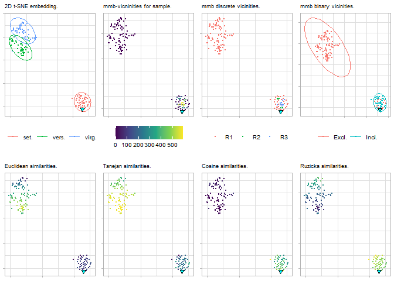
